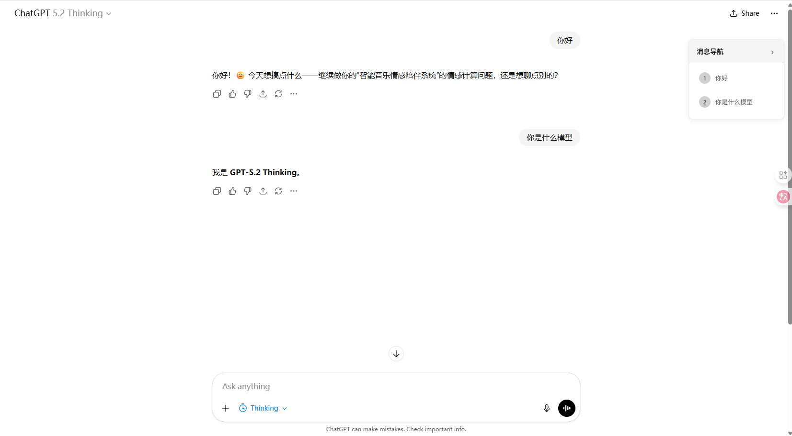
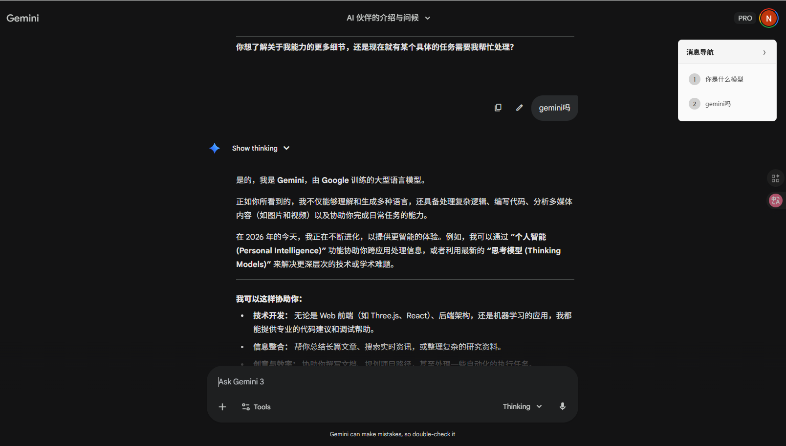
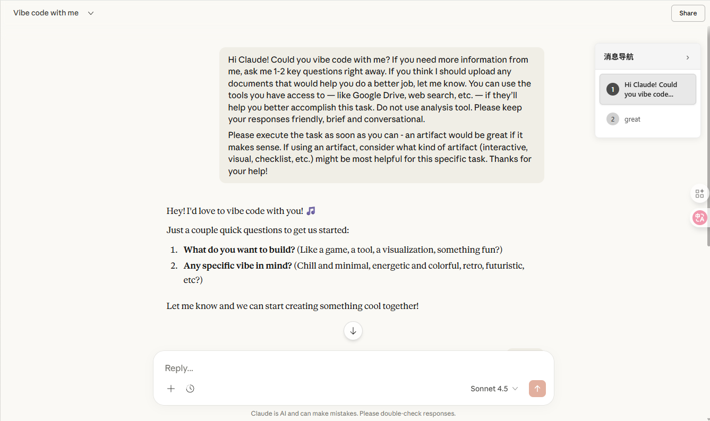

# GPT/Gemini 消息导航插件

一款为 ChatGPT 和 Gemini 网页版设计的浏览器插件，提供消息导航功能，快速定位历史对话。


## ✨ 功能特性

- 🎯 **自动检测消息** - 实时监测用户发送的消息
- 📍 **快速跳转** - 点击导航节点即可定位到对应消息
- 🎨 **精美界面** - 毛玻璃效果，支持深色模式
- 🔄 **实时同步** - 自动更新导航列表
- ⚡ **性能优化** - 轻量级设计，不影响页面性能

## 🚀 安装方法

### 开发者模式安装（推荐）

1. 下载或克隆此项目到本地
   ```bash
   git clone https://github.com/FengZio/GPT_navigation_bar
   cd GPT_navigation_bar
   ```

2. 打开浏览器扩展管理页面
   - **Chrome**: 访问 `chrome://extensions/`
   - **Edge**: 访问 `edge://extensions/`

3. 启用"开发者模式"（页面右上角）

4. 点击"加载已解压的扩展程序"

5. 选择项目文件夹 `e:\GPT_navigation_bar`

6. 插件安装完成！

## 📖 使用说明

1. 访问 [Gemini](https://gemini.google.com) 或 [ChatGPT](https://chat.openai.com)

2. 开始对话，发送消息

3. 页面右侧会自动显示消息导航条

4. 点击导航条中的任意节点，页面会平滑滚动到对应消息

5. 当前查看的消息会高亮显示

## 🎨 界面示例

### ChatGPT 中的效果

*在 ChatGPT 中使用插件，右侧显示消息导航条，点击节点即可快速定位*

### Gemini 中的效果

*在 Gemini 中使用，毛玻璃效果与页面完美融合*

### Claude 中的效果

*在 Claude 中同样支持完整的导航功能*

## 🛠️ 技术架构

### 文件结构
```
gpt_navigation_bar/
├── manifest.json       # 插件配置文件
├── content.js          # 核心功能脚本
├── styles.css          # 样式文件
├── icons/              # 插件图标
│   ├── icon-16.png
│   ├── icon-48.png
│   └── icon-128.png
└── README.md           # 说明文档
```

### 核心技术
- **MutationObserver** - 监听 DOM 变化，自动检测新消息
- **IntersectionObserver** - 优化滚动性能
- **CSS3** - 毛玻璃效果、渐变色、动画
- **Manifest V3** - 最新的浏览器插件规范

## 🎯 适配网站

- ✅ **ChatGPT** (chat.openai.com / chatgpt.com)
- ✅ **Gemini** (gemini.google.com)
- ✅ **Claude** (claude.ai)
- ✅ **文心一言** (yiyan.baidu.com)
- ✅ **通义千问** (qianwen.com)

## 🔧 开发调试

如需修改代码：

1. 编辑源文件（`content.js`、`styles.css` 等）

2. 在浏览器扩展页面点击 🔄 刷新按钮

3. 刷新目标网页即可看到更新效果

## 📝 版本历史

### v1.0.0 (2026-01-17)
- 🎉 初始版本发布
- ✨ 实现基础消息导航功能
- 🎨 精美 UI 设计
- 🌓 深色模式支持

## 📄 许可证

MIT License

## 🤝 贡献

欢迎提交 Issue 和 Pull Request！

## 📧 联系方式

如有问题或建议，请通过 Issue 反馈。

---

**享受更高效的对话体验！** 🚀
